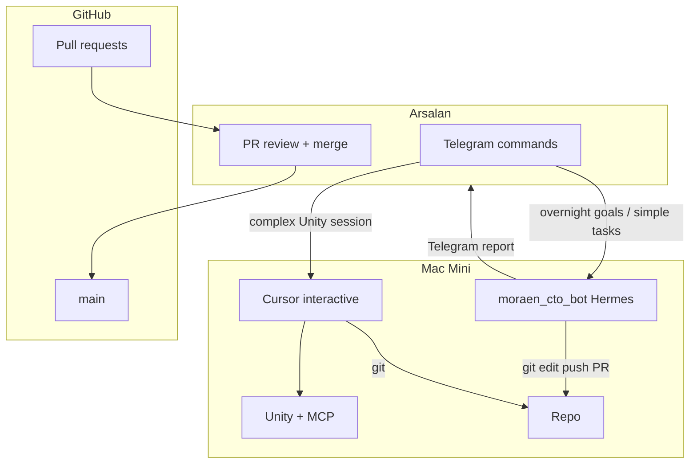

# GroundWork — Multi-Agent Coordination

**Living file** — update when queue or roles change.  
**Repo:** `appopoleisStudios/karjat-farms`

---

## Agents

| Agent | Interface | Runs on | Cost | Best for |
|---|---|---|---|---|
| **Arsalan** | Cursor, Telegram, review | Any | — | Vision, approve PRs, playtest, merge |
| **Cursor (interactive)** | Cursor IDE + MCP | Mac Mini | Cursor subscription | Unity MCP, complex debug, architecture with you present |
| **Moraen CTO bot** | Telegram `@moraen_cto_bot` | Mac Mini (`~/.hermes/profiles/cto/`) | **Free** (Hermes + free-tier models) | Overnight docs, research, boilerplate, small PRs, SDLC chores |

---

## Merge rule (GroundWork)

| Actor | May merge to `main` |
|---|---|
| Arsalan | **Yes** — primary merge gate for this repo |
| Moraen CTO bot | **No** — opens PRs only |
| Cursor agent | **No** — opens PRs only |
| Claude (via claude_bridge) | Optional — hard merges / conflict fix when Moraen hands off |

---

## Active queue

| # | Branch | Owner | Task | Status |
|---|---|---|---|---|
| 1 | `docs/phase0-p0` | Moraen bot | Complete 8 P0 docs | open |

Update this table when starting or finishing work.

---

## Changelog

| Date | Who | Change |
|---|---|---|
| 2026-06-05 | Cursor | Initial GroundWork coordination; Moraen CTO bot integrated |
