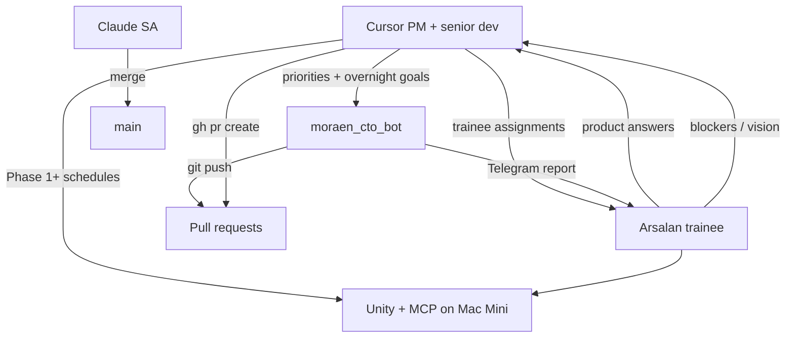

# GroundWork — Multi-Agent Coordination

**Living file** — update when queue or roles change.  
**Repo:** `appopoleisStudios/karjat-farms`

---

## Team roles

| Role | Who | Responsibility |
|---|---|---|
| **Senior Dev + PM** | Cursor (this agent) | Roadmap, priorities, architecture, PR review guidance, GTM/tech research, trainee assignments |
| **Trainee — Product** | Arsalan | Vision input, playtest, product answers, learn-by-doing tasks assigned by PM; escalates blockers |
| **Async engineer** | Moraen CTO bot (`@moraen_cto_bot`) | Overnight docs, research, boilerplate — commit + push only; scoped by PM via Telegram goals |
| **Interactive dev** | Cursor + Arsalan at Mac Mini | Unity MCP sessions, complex debug when PM schedules them |

**Decision flow:** Moraen bot commits on branch → **PM (Cursor) reviews, fixes, opens PR from moraen-Home** → **Claude SA audit (devil's advocate)** → PM addresses comments → **Claude merges** → trainee learns from diff.

## SDLC — docs & PRs

| Step | Owner | Action |
|---|---|---|
| 1 | Moraen bot | Overnight doc commits; `git push` to feature branch **only** |
| 2 | **Cursor PM** | Review vs [HANDOFF-MORAEN.md](HANDOFF-MORAEN.md); fix errors; update [qa/pm-doc-review.md](qa/pm-doc-review.md) |
| 3 | **Cursor PM** | **`gh pr create` from moraen-Home** — always; never Mac Mini `gh` |
| 4 | **Claude SA** | PR audit — devil's advocate, design gaps, acceptance table |
| 5 | **Cursor PM** | Revise docs from SA feedback; push to same PR |
| 6 | **Claude SA** | Approve + **merge to `main`** |
| 7 | Arsalan (trainee) | Read merged docs; answer product questions flagged in review |

## Agents (tools)

| Agent | Interface | Runs on | Cost | Best for |
|---|---|---|---|---|
| **Cursor (PM + senior dev)** | Cursor IDE | moraen-Home / Mac Mini | Cursor subscription | Roadmap, research, code review, architecture, trainee task design |
| **Arsalan (trainee)** | Cursor, Telegram | Any | — | Overnight goals, playtest, product answers |
| **Moraen CTO bot** | Telegram `@moraen_cto_bot` | Mac Mini | **Free** | Overnight docs/research/PRs per PM-written goals |
| **Cursor interactive** | Cursor IDE + MCP | Mac Mini | Cursor subscription | Unity MCP, live pairing with trainee |

---

## Merge rule (GroundWork)

| Actor | May merge to `main` |
|---|---|
| **Claude SA** | **Yes** — after SDLC audit pass (primary merge gate for GroundWork) |
| Arsalan (trainee) | Learn + product decisions; merge only when PM delegates |
| Moraen CTO bot | **No** — push commits only; never `gh pr create` |
| Cursor PM | **No** — opens PRs; revises from SA feedback |

---

## Active queue

| # | Branch | Owner | Task | Status |
|---|---|---|---|---|
| 1 | `docs/phase0-p0` | Moraen bot | Complete 8 P0 docs (PM-scoped nights 1–4) | in progress |
| 2 | `docs/phase0-p0` | PM (Cursor) | GTM intel research brief | done → [gtm-twitter-intel-research.md](ops/gtm-twitter-intel-research.md) |
| 3 | — | Trainee (Arsalan) | Answer product questions in [qa/pm-doc-review.md](qa/pm-doc-review.md) | pending |
| 4 | `docs/phase0-p0` | Claude SA | Audit PR — devil's advocate on design docs | pending |

Update this table when starting or finishing work.

---

## Trainee assignments (current sprint)

Assigned by PM. Do in order; ask in Cursor if blocked >30 min.

| # | Task | Done when |
|---|---|---|
| T1 | Send Night 1 overnight goal to `@moraen_cto_bot` (see [moraen-cto-tasks.md](ops/moraen-cto-tasks.md)) | Bot acknowledges; work starts overnight |
| T2 | Read SA checklist in [qa/sa-audit-night1.md](qa/sa-audit-night1.md); answer product Q1/Q3 if flagged | Reply to PM in Telegram or PR comment |
| T3 | Read [gtm-twitter-intel-research.md](ops/gtm-twitter-intel-research.md); pick **one** Chronicler fix to prioritize | Reply to PM with choice + why (1 paragraph) |
| T4 | Play `index.html` prototype 10 min; note 3 things that must survive into Unity MVP | Add bullets to next dev-log entry or tell PM |

---

## Changelog

| Date | Who | Change |
|---|---|---|
| 2026-06-05 | Cursor | Initial GroundWork coordination; Moraen CTO bot integrated |
| 2026-06-05 | Cursor (PM) | SDLC: PM opens PR from moraen-Home; Claude SA audits + merges; pm-doc-review loop |
