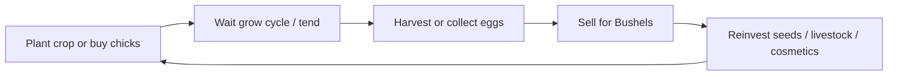

# GroundWork — Game Design Document (GDD)

**Status:** complete (PM draft — pending SA review)  
**Phase:** 0 P0  
**Author:** Cursor PM (2026-06-06)  
**Cross-ref:** [time-system.md](time-system.md) · [karjat-region-bible.md](../geo/karjat-region-bible.md) · [crops.json](../karjat-economy/crops.json)

---

## 1. Vision

GroundWork is a mobile farm simulation where players cultivate land under **real agricultural rhythms** — starting with **Karjat, Raigad district** as the hand-tuned flagship region. Players plant crops, tend livestock, harvest, and reinvest **Bushels** (soft in-game currency) into their farm. The long-term vision extends to an **Earth-map land economy** where coordinates drive environmental and geopolitical rules; the MVP deliberately scopes to a single rich T0 region so pacing, economy, and compliance can be proven before scale.

The prototype in `index.html` already validates core feel: four Karjat vegetables, IST day/night sky, touch planting, and a simple harvest-sell loop. Unity + Farming Engine carries that loop forward with seasonal gates, six crops, and chicks — still offline-first, Android-first, and **India social-game compliant** (no real-money cash-out in the India build).

---

## 2. Design pillars

GroundWork’s **GeoEcosystem** rests on five pillars (full global expression deferred to Phase 2.5+; Karjat T0 implements a subset):

| Pillar | Karjat MVP expression |
|---|---|
| **Environmental** | Monsoon vs dry-season rhythm; laterite soil flavor; IST cosmetic clock |
| **Agricultural** | Kharif / Rabi / Zaid planting gates; six MVP crops with researched mandi direction |
| **Farmer ecosystem** | Crops + chicks (eggs); azolla pond and grow bags deferred to v1.1 |
| **Social / economic** | Phase 1: direct harvest-sell for Bushels. Phase 2: fixed-price player market + AI weekly trader |
| **Geopolitical** | India build = social game only. Global earn build geo-blocked from India (Phase 4+) |

**Authenticity rule:** Marketing may say “inspired by Karjat Kharif/Rabi rhythms” — not day-perfect almanac accuracy (see time-system §3 caveat).

---

## 3. Core gameplay loop

**Session shape:** A casual session is 5–15 real minutes — plant, check progress, harvest, sell. One **game-day = 20 real minutes**; one **game-year = 90 game-days** (~30 hours active play spread over calendar time).

**Currency:** Bushels only in India MVP. Players start with **100 Bushels** (prototype). First meaningful sink: **chicks at 500 Bushels** (mid-game goal, ~25–50 crop harvests at prototype tuning).

**Market evolution:**

| Phase | Sell path |
|---|---|
| **Phase 1 (MVP offline)** | Tap harvest → instant Bushel credit (direct sell UI) |
| **Phase 2** | Fixed-price listings on player market; AI weekly trader buys surplus at village discount |
| **Phase 4+ (global build only)** | Withdrawal-eligible wallet — **not in India build** |

**Naming (UI):** English primary labels with Hindi transliteration in subtitles — e.g. `Spinach (palak)`. See `crops.json` `namingPolicy`.

---

## 4. MVP scope (India social launch)

**In scope:**

| Feature | Detail |
|---|---|
| **Crops** | 6 total: methi, red amaranth (lal saag), radish (mooli), spinach (palak), paddy (Karjat Kolam), finger millet (nachni). Four playable from prototype; paddy/nachni may ship as “Coming Soon” UI until Phase 1 playtest confirms params |
| **Livestock** | Chicks → feed → eggs → sell (500 Bushel entry) |
| **Region** | Karjat T0 only — no Earth map |
| **Time** | 20 min/game-day; 90 game-day/year; IST sky; Kharif/Rabi gates |
| **Platform** | Android-first |
| **Save** | Local JSON (Farming Engine save); cloud sync Phase 2 |
| **Monetization** | Cosmetic IAP + Farmer’s Pass (no gameplay advantage) |
| **Language** | English UI; Hindi crop names as Latin transliteration |

**Starter onboarding:** Grant Bushels → force first crop plant → teach harvest-sell → surface chicks as aspirational purchase.

---

## 5. Out of scope (MVP)

Explicit **no** list — do not scope-creep before Phase 1 exit gate:

- Earth map, land deeds, free lease, paid deed IAP
- Bushel → INR / UPI / Telegram Stars withdrawal (**India: never**)
- Player-to-player market (Phase 2)
- AI weekly trader + dev farm bot (Phase 2)
- Full order-book matching
- Azolla pond, grow bags, additional livestock species
- iOS App Store launch
- Blockchain / NFT / Web3
- Multiplayer co-op
- Partner Agent API (Phase 3.5)
- Water-as-resource economy (Phase 2+; MVP uses season gates only)
- Rice transplanting mini-game

---

## 6. Player personas

### Persona A — “Evening farmer” (primary)

- **Profile:** 25–40, Maharashtra urban/suburban, 10 min/day on phone
- **Goal:** Relaxing progression loop; recognizable crop names (methi, palak)
- **Success:** Completes one harvest per session; saves toward 500 Bushel chicks
- **Risk if we fail:** Sessions feel too slow (growTime tuning) or too grindy (chick price)

### Persona B — “Market optimizer” (Phase 2+)

- **Profile:** Engaged player who tracks seasonal crop margins
- **Goal:** Plant Kharif flagship (paddy) at season open; sell at peak listing price
- **Success:** Positive Bushel ROI vs seed + time cost
- **MVP note:** Persona B is **latent in Phase 1** (direct sell only) — design docs must not promise market depth before Phase 2

---

## 7. Monetization

### Player-facing (India build)

| Item | Rule |
|---|---|
| Bushels | Earned in-game only; **no real-money purchase of Bushels** in MVP (PROGA) |
| Cosmetics | Fence skins, avatar hats, farm decorations via Google Play IAP |
| Farmer’s Pass | Seasonal cosmetic bundle + convenience (e.g. extra cloud save slots) — **no yield boost** |
| Withdrawal | **Disabled** — copy: “Bushels have no cash value” |

### Developer revenue (post-launch trajectory)

| Stream | Phase |
|---|---|
| Cosmetic IAP + Farmer’s Pass | Phase 3 soft launch |
| Land deed sales | Phase 2.5+ |
| Partner Agent API | Phase 3.5 |
| Global treasury spread | Phase 4 (UAE entity, geo-blocked from India) |

---

## 8. Success metrics (soft launch targets)

| Metric | Target (directional) | Why |
|---|---|---|
| D1 retention | ≥35% | Core loop must hook in first session |
| Sessions / week | ≥4 for engaged cohort | 20-min game-days support daily check-ins |
| Phase 1 playtest | 5 humans × 1 game-week offline | Exit gate before Supabase |
| Bushel balance drift | ±20% of spreadsheet model | Economy not broken |
| Crash-free sessions | ≥99% on mid-range Android | Farming Engine + URP baseline |

**Qualitative:** Playtesters can name at least three crops in English + transliteration without confusion.

---

## 9. Open questions (GDD — owner + defer)

| # | Question | Owner | Disposition |
|---|---|---|---|
| G1 | growTime unit: prototype real-min vs game-calendar Model B | PM + playtest | **Defer Phase 1** — SA recommends Model B after playtest |
| G2 | Ship 4 or 6 playable crops at soft launch | Arsalan | **4+2 Coming Soon** accepted per SA |
| G3 | Chick price 500 Bushels — too steep for D1? | Phase 1 playtest | Tune after offline week |
| G4 | Hindi voice-over | Arsalan | **Defer Phase 2** — English UI Phase 1 |

---

## 10. Document map

| Topic | Spec |
|---|---|
| Time & seasons | [time-system.md](time-system.md) |
| Crops & mandi | [crops.json](../karjat-economy/crops.json), [crops.md](../karjat-economy/crops.md) |
| Region flavor | [karjat-region-bible.md](../geo/karjat-region-bible.md) |
| Engine strip list | [farming-engine-audit.md](../tech/farming-engine-audit.md) |
| Architecture | [architecture.md](../tech/architecture.md) |
