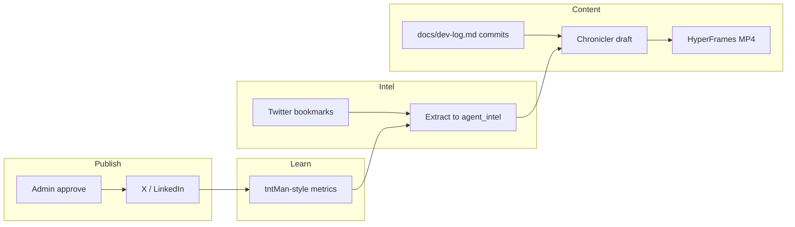

# GroundWork GTM — Twitter Intel Research Brief

**Date:** 2026-06-05  
**Source:** `intel.bookmarks` (1,096 rows) + `intel.agent_intel` (2,885 rows) in Supabase  
**Query method:** Keyword + department filters; semantic search via Router `/v1/intel/search` or MCP `search_intel`  
**Audience:** Arsalan — decide what to wire while Moraen completes P0 docs

---

## Executive summary

You already own **80% of the social automation stack** in `ai-router` (Chronicler, HyperFrames, ViMax, Twitter intel pipeline, tntMan experiment loop). GroundWork should **reuse that infrastructure** with a new `project=groundwork` filter — not buy new SaaS.

Highest-leverage moves for a Karjat farming sim:

| Priority | Action | Why |
|---|---|---|
| **P0** | Fix Chronicler Twitter publisher (tweepy OAuth) | LinkedIn already posts 1×/day; Twitter path is built but broken |
| **P0** | Tag intel + Chronicler drafts with `project=groundwork` | Keeps Appopoleis B2B noise out of game GTM |
| **P1** | HyperFrames devlog shorts (mandi tips, crop facts) | HTML→MP4 pipeline tested on Linux PC; no new tool |
| **P1** | Reddit + X listening for indie/mobile farming hooks | Bookmarks + MillieMarconnni “30-day scan” skill pattern |
| **P2** | Appeeky MCP for Play Store ASO | Bookmarked indie ASO success story |
| **P2** | Evaluate AiToEarn (OSS, 14 platforms) | Only if Chronicler multi-platform gap remains |

---

## What the vector DB is

| Table | Rows | Role |
|---|---|---|
| `intel.bookmarks` | 1,096 | Raw bookmark text + pgvector embeddings (`nomic-embed-text`) |
| `intel.agent_intel` | 2,885 | Extracted insights, tags, department, `project`, expiry tiers |
| `intel.brain_queries` | 56 | Cached Q&A over intel |
| `intel.cto_proposals` | 0 | Tool integration proposals (unused — good place for GroundWork tickets) |

**Ingestion:** Hermes skill `archive_twitter_bookmarks` → Router `/v1/intel/scrape-bookmarks`  
**Search:** MCP `intel_mcp_server.py` → `search_intel(query)` or SQL keyword filters  
**Memory tiers:** Twitter signals expire in 21 days; marketing episodic in 30 days — re-extract GroundWork-relevant intel into `project=groundwork` rows with longer retention.

**Security note:** `intel.*` tables currently have RLS disabled. Do not expose anon keys client-side until policies are added.

---

## Tier 1 — Already built (reuse for GroundWork)

### Chronicler v2 (Linux PC / umar-asus)

Pipeline already documented in `ai-router/docs/cto-briefing-chronicler-handoff.md`:

```
intel.agent_intel → draft → humanize → chart/video → chronicler_posts → approve → publish
```

| Channel | Status | GroundWork use |
|---|---|---|
| **LinkedIn** | ✅ Live (1×/day IST window) | “Building in public” — Karjat ag-tech, India MVP |
| **Twitter/X** | 🔴 Broken (twikit; needs tweepy OAuth 1.0a) | Devlog threads, crop screenshots, mandi data drops |
| **Blog** | ✅ Supabase `website.blog_posts` | Long-form GDD excerpts, region bible teasers |

**Fix queued since May 15** (in intel): replace twikit with `tweepy.Client.create_tweet`, add rejection memory so bad drafts don’t repeat.

**GroundWork wiring:** Add `project=groundwork` filter in Chronicler cron + SOUL voice tuned for authentic farmer-dev tone (not B2B Appopoleis).

### HyperFrames + ViMax (Linux PC GPU)

| Tool | Fit | Content ideas |
|---|---|---|
| **HyperFrames** | ✅ Tested — HTML→1080p MP4 | “20 min = 1 game day”, Kharif/Rabi calendar, 6-crop showcase |
| **ViMax** | ✅ Configured (Gemini/Veo limits) | Rare — 10 videos/day cap; use for launch trailer only |
| **Matplotlib charts** | ✅ In Chronicler | Mandi price trends from `crops.json` |

Template placeholders already exist: `POST_CONTENT_HERE`, `STAT1_VAL`, `STAT2_VAL`.

### tntMan autonomous marketing loop (pattern, not product)

`ai-router/tntman_automation_plan.md` defines the experiment engine GroundWork should copy:

- **Collector** — metrics from Telegram, Instagram, WhatsApp every 6h  
- **Decision engine** — scale / kill experiments on ±20% metric moves  
- **Reporter** — daily Telegram KPI digest  

Adapt for GroundWork: track X impressions, Play Store page views, Discord joins, wishlist clicks (when store page exists).

### SEO + intel platform (Appopoleis.com stack)

`docs/seo-platform-strategy.md` — GSC + SERP scraper + Twitter intel competitor analysis.  
For GroundWork: separate property (`farms.appopoleis.com` or Play Store listing) with its own keyword seeds: *farming sim India*, *Karjat*, *mandi game*, *Stardew-like Android*.

### Hermes intel MCP

On Mac Mini / Linux PC when Router is up:

```bash
# MCP tools: scrape_bookmarks, search_intel, deep_read
search_intel("indie game marketing automation TikTok devlog")
```

---

## Tier 2 — Bookmarked tools worth evaluating

### Social publishing & automation

| Tool | Source | Verdict |
|---|---|---|
| **AiToEarn** (@JafarNajafov) | OSS agent — create/publish/engage on **14 platforms** | **Evaluate** — may replace manual Chronicler gaps; smoke-test API stability before trusting |
| **Brightbean Studio** | Multi-platform OAuth hub (researched, not deployed on Linux PC) | **Defer** — Chronicler provider pattern already covers X + LinkedIn + blog |
| **Marketing Skills v1.10** (@coreyhainesco) | `/co-marketing` partner + campaign frameworks | **Use for prompts** — joint campaigns with ag-tech influencers |
| **AutoGTM / Okara “AI CMO”** | Hype-heavy launch tools | **Skip** — you have Chronicler + intel |

### Research & copy generation

| Tool | Source | Verdict |
|---|---|---|
| **Reddit+X scan skill** (@MillieMarconnni) | Claude Code skill — 30-day topic scan → copy-paste prompts | **High value** — run monthly for `indiegaming`, `AndroidGaming`, `IndianGaming`, `farmingsims` |
| **Lightreel** (@Jibran_05) | TikTok UGC hook analysis | **P2** — when shooting vertical crop gameplay clips |
| **Reddit API search tool** (intel) | Real-time Reddit for AI clients | **Wire to Moraen** — mandi/farming pain-point mining |
| **Free CLI multi-platform search** (intel) | Twitter, Reddit, YouTube, GitHub without API fees | **Dev-only** — rate-limit risk; prefer official APIs for production |

### App store & monetization

| Tool | Source | Verdict |
|---|---|---|
| **Appeeky MCP** | ASO success for indie dev | **P1 at Play Store listing** — keywords: farming sim, India, offline |
| **App Store screenshot skill** (@JorgeCastilloPr) | Claude skill from production code | **P1** — auto screenshots from Unity when CI exists |
| **RevenueCat referrals** (@ChrisKruegerDev) | Referral system pattern | **Phase 2+** — if Bushels IAP or premium regions |
| **Apple 15% small business rate** (@ModestMitkus) | Requires opt-in form | **Do once** at iOS launch |
| **App Store Award long-tail** (@Jahjiren) | 4+ years organic boost | **Aspirational** — polish narrative for editorial |

### Game dev acceleration (build, not market)

| Tool | Source | Verdict |
|---|---|---|
| **Unity/Unreal/Blender MCP** (@minchoi) | Prompt-driven 3D scenes | **Already in dev-workflow** — Phase 1 Unity MCP |
| **AI spritesheet workflow** (@techhalla) | Freepik → spritesheet in minutes | **Evaluate for sprite pipeline** — complements `sprites3/` prototype |
| **Qwen “Octopus Invaders” benchmark** (@sudoingX) | Full game from single prompt | **Inspiration only** — GroundWork is Unity + Farming Engine, not LLM-generated game |
| **OSGameClones DB** (@sukh_saroy) | 1000+ open-source game clones | **Reference** — farming sim mechanics comparison for FE audit |

### Visual content for social

| Tool | In intel | Verdict |
|---|---|---|
| **SenseNova-U1** | 8B infographic model | **Low priority** — mandi infographics when GPU idle |
| **Taste-Skill** | Anti-slop design + copy patterns | **Use for Chronicler voice** — authentic devlog, not AI slop |
| **PersonaLive / Short Video Engine** | Deferred in intel | **Skip** — HyperFrames covers explainers |

---

## Tier 3 — GroundWork-specific GTM strategy

### Content pillars (authenticity = GTM)

GroundWork’s GTM story is **real Karjat ag + real devlog**, not generic indie hype:

1. **Devlog** — Phase 0 doc progress, Unity imports, mandi research citations  
2. **Ag education** — Kharif/Rabi, water stress, Raigad mandi (from region bible)  
3. **Prototype nostalgia** — `index.html` pixel loop → Unity upgrade arc  
4. **India-first** — Hindi/Marathi snippets optional; IST posting windows  

### Channel plan (MVP → launch)

| Phase | Channel | Automation | Human |
|---|---|---|---|
| **Now (P0 docs)** | X thread 2×/week | Chronicler drafts from `dev-log.md` commits | Approve in admin panel |
| **Unity alpha** | X + LinkedIn + short MP4 | HyperFrames from commit highlights | Playtest clips you record |
| **Play Store beta** | + Reddit posts | Scheduled via Chronicler; Reddit manual (anti-spam) | Community replies |
| **Launch** | + TikTok/Reels | Lightreel hook research; manual upload first | UGC reposts |

### Reddit targets (from intel)

- r/indiegaming, r/AndroidGaming, r/IndianGaming  
- r/farmingsims, r/gamedev (Screenshot Saturday)  
- Startup subs only for **studio story**, not spam  

Use **Reddit Customer Acquisition** intel pattern: find threads about farming games / Indian mobile games → reply with substance, link only when asked.

### Orchestration stack (recommended)



**Cron host:** Linux PC (`100.79.34.78`) — same as Chronicler today.  
**Project filter:** `intel.agent_intel.project = 'groundwork'`.

---

## Concrete next tasks (for you or Moraen)

| # | Task | Owner | Effort |
|---|---|---|---|
| 1 | Chronicler tweepy fix + test post | Moraen / Claude | 2h |
| 2 | Add `project=groundwork` to Chronicler + cron | Moraen | 1h |
| 3 | Create GroundWork SOUL snippet (voice, hashtags, no B2B) | Arsalan + Moraen | 1h |
| 4 | First HyperFrames template: “6 crops of Karjat” | Cursor + you | 3h |
| 5 | Bookmark farming-sim / indie gamedev accounts → scrape | Hermes `scrape_bookmarks` | 30m |
| 6 | Run `search_intel("farming sim mobile marketing India")` monthly | Automated cron | 30m |
| 7 | Draft Play Store ASO keyword list via Appeeky MCP | Phase 1 | 2h |
| 8 | Copy tntMan metrics schema for X + Play Console | Moraen | 4h |

---

## Queries to re-run in intel

Use Router API or Supabase:

```sql
-- Fresh game-dev bookmarks
SELECT author_handle, LEFT(content, 200), url
FROM intel.bookmarks
WHERE content ILIKE '%unity%' OR content ILIKE '%indie game%'
   OR content ILIKE '%farming%' OR content ILIKE '%pixel%'
ORDER BY bookmarked_at DESC LIMIT 20;

-- Marketing automation insights
SELECT topic, LEFT(insight, 250), tags
FROM intel.agent_intel
WHERE department IN ('marketing', 'outbound', 'seo')
  AND insight ILIKE '%automation%'
ORDER BY relevance_score DESC LIMIT 15;
```

MCP semantic search (better than keywords):

```
search_intel("indie farming game launch marketing TikTok devlog automation", match_count=10)
search_intel("Unity MCP game development workflow tools", match_count=8)
search_intel("social media scheduling open source self hosted", match_count=8)
```

---

## What to skip

| Item | Why |
|---|---|
| CrofAI / generic AI CMO SaaS | Banned; you have Chronicler |
| TikTok full automation bots (@mattwelter) | ToS / authenticity risk |
| Buy SEMrush/Ahrefs | Your seo-platform-strategy builds niche SEO at $0 |
| ViMax for daily posts | GPU + Veo rate limits; reserve for trailer |
| OR `:free` models for overnight intel extraction | Smoke-test failures; use NIM M2.7 on Mac Mini |

---

## References

| Resource | Location |
|---|---|
| Intel MCP server | `ai-router/mcp/intel_mcp_server.py` |
| Chronicler handoff | `ai-router/docs/cto-briefing-chronicler-handoff.md` |
| SEO platform plan | `ai-router/docs/seo-platform-strategy.md` |
| tntMan automation | `ai-router/tntman_automation_plan.md` |
| Twitter intel workflow | `ai-router/INTEL.md` |
| GroundWork dev workflow | [dev-workflow.md](../tech/dev-workflow.md) |
| Moraen task routing | [moraen-cto-tasks.md](moraen-cto-tasks.md) |

---

## Appendix — Top bookmark handles to follow / scrape

| Handle | Topic |
|---|---|
| @minchoi | Unity/Blender MCP game dev |
| @techhalla | AI spritesheet workflow |
| @techhalla / @sudoingX | Indie game AI benchmarks |
| @ChrisKruegerDev | RevenueCat referrals |
| @JafarNajafov | AiToEarn multi-platform |
| @coreyhainesco | Marketing Skills |
| @hridoyreh | SEO + Reddit growth |
| @MillieMarconnni | Reddit/X scan → Claude prompts |
| @Jibran_05 | TikTok UGC analysis (Lightreel) |
| @nyk_builderz | Hermes agent ecosystem |

Run `scrape_bookmarks(date_range=last_month, max_tweets=50)` after following new accounts to refresh vectors.
