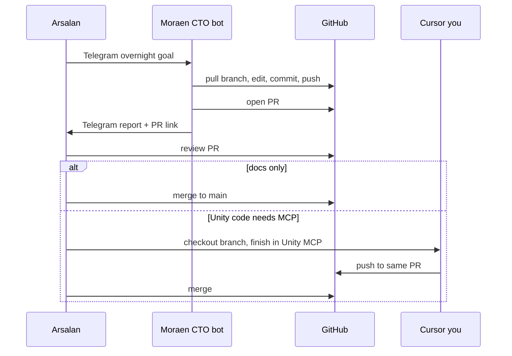

# Moraen CTO Bot — GroundWork Task Guide

**Bot:** Telegram `@moraen_cto_bot` (Hermes profile `~/.hermes/profiles/cto/` on Mac Mini)  
**Cost:** Free — uses Hermes gateway + free-tier model routing  
**Models:** [moraen-model-routing.md](moraen-model-routing.md) — deepseek-v4-flash primary, not MiniMax M2.7  
**Workflow:** [dev-workflow.md](../tech/dev-workflow.md) · **Queue:** [coordination.md](../coordination.md)

---

## What Moraen bot is

Moraen CTO is your **async engineering labor** on Mac Mini. You message it on Telegram; it works in the git repo, opens PRs, and reports back — often overnight while you sleep.

It shares Mac Mini with Unity and Cursor but runs **headless** via Hermes (no Unity MCP unless explicitly wired later).

| Capability | Moraen bot | Cursor interactive |
|---|---|---|
| Write markdown docs | **Yes — primary** | Yes |
| Research (Agmarknet, web) | **Yes — primary** | Yes |
| Edit JSON/config files | **Yes** | Yes |
| Git branch, commit, push, open PR | **Yes** | Yes |
| Merge to `main` | **No** | No |
| Drive Unity Editor (MCP) | No | **Yes — primary** |
| Play mode / Android build | No | **Yes (with you)** |
| Complex architecture pairing | Limited | **Yes — primary** |

---

## Task routing — who does what?

### Send to **Moraen bot** (Telegram)

Good for **bounded, spec-driven, offline-safe** work:

- Fill P0 doc outlines (`docs/gdd/*.md`, `docs/tech/*.md`, `docs/geo/*.md`)
- Research Raigad mandi prices → update `crops.json` + `crops.md`
- Extract prototype data from `index.html` into JSON/schemas
- Write Supabase migration **drafts** + `docs/backend/*.md` (no prod deploy)
- Boilerplate C# stubs, ScriptableObject templates from `crops.json`
- Update `docs/dev-log.md` after each bot session
- Open PR; post summary on Telegram

### Use **Cursor interactive** (you at Mac Mini)

Good for **Unity MCP, judgment, live iteration**:

- Import Farming Engine; first scene setup
- MCP: create GameObjects, wire PlantData, run Play mode
- Debug compile errors with Unity console open
- Architecture decisions you want to discuss live
- Supabase MCP sessions with live schema push (when ready)

### **You (Arsalan)** only

- Approve and merge PRs to `main`
- Playtest feel/balance on device
- Legal/compliance sign-off
- Purchases (Farming Engine $49, Unity license)
- Set overnight goals on Telegram

---

## Telegram message templates

### Overnight goal (end of day)

Send to `@moraen_cto_bot`:

```text
GroundWork overnight — karjat-farms

Repo: appopoleisStudios/karjat-farms
Branch: docs/phase0-p0
Base: origin/docs/phase0-p0 (pull first)

Goals (in order):
1. Complete docs/gdd/time-system.md — acceptance criteria in docs/HANDOFF-MORAEN.md
2. Complete docs/geo/karjat-region-bible.md — 6 crops, Raigad context
3. Research Agmarknet Raigad prices; fill paddy + nachni in docs/karjat-economy/crops.json
4. Append docs/dev-log.md
5. Commit + push + open PR titled "docs: Phase 0 time-system, region bible, crop data"
6. Telegram report: files changed, open questions, PR link

Read first: docs/HANDOFF-MORAEN.md, docs/ops/moraen-cto-tasks.md
Session: send /reset to @moraen_cto_bot before this goal (fresh context)
Models: primary deepseek-v4-flash; delegate JSON to qwen3-next-80b:free; GDD/arch via NIM glm-5.1 if stuck
Do NOT: merge to main, start Unity, touch secrets
```

### Simple daytime task

```text
GroundWork task — karjat-farms

Branch: docs/phase0-p0
Do: Complete docs/tech/repo-structure.md per plan §12 folder tree
Acceptance: docs/HANDOFF-MORAEN.md table row 4
When done: push + reply with diff summary (no merge)
```

### Hand off to Claude (hard merge / conflict)

When Moraen bot hits a blocker it can't resolve:

```text
Moraen: escalate to Claude via claude_bridge
Repo: karjat-farms
PR: #NNN
Blocker: describe conflict or decision needed
```

(Moraen bot uses existing `claude_bridge.py` on Mac Mini — same as ai-router SDLC.)

---

## Overnight schedule (suggested)

| Time (IST) | What runs |
|---|---|
| **Day** | You + Cursor for Unity MCP / design decisions |
| **~22:00** | You send overnight Telegram goal to Moraen |
| **22:00–08:00** | Moraen bot works on Mac Mini (docs, research, PRs) |
| **08:00** | Moraen Telegram report; you review PR over coffee |
| **Weekend** | Batch overnight goals for doc sprints |

Mac Mini must stay awake (Energy settings) and Hermes gateway running (`ai.hermes.gateway-cto`).

---

## SDLC flow with Moraen bot



---

## Repo setup for Moraen bot (one-time on Mac Mini)

Moraen bot needs a local clone on Mac Mini (same as Cursor):

```bash
git clone https://github.com/appopoleisStudios/karjat-farms.git ~/projects/karjat-farms
```

Ensure Moraen Hermes profile has GitHub token + git credentials for `appopoleisStudios/karjat-farms`.  
Add GroundWork to Moraen SOUL/MEMORY repo list if not already present (Mac Mini `~/.hermes/profiles/cto/`).

---

## Quality gates (Moraen bot must follow)

- Read acceptance criteria in `docs/HANDOFF-MORAEN.md` before marking doc done
- Update checkbox in `docs/README.md` when a P0 doc is complete
- Append `docs/dev-log.md` every session
- Never commit `.env`, keys, Unity `Library/`
- Never merge to `main`
- If spec ambiguous → mark `TBD` in doc + list question in Telegram report

---

## Example overnight backlog (Phase 0)

| Night | Moraen bot goal |
|---|---|
| 1 | `time-system.md` + `repo-structure.md` |
| 2 | `karjat-region-bible.md` + `crops.json` paddy/nachni |
| 3 | `GDD.md` + `architecture.md` |
| 4 | `farming-engine-audit.md` + update `docs/README.md` checkboxes |
| 5 | Final PR polish; split or merge PR for review |

You do **zero** doc writing if Moraen bot runs all five nights — you only review and merge.

---

## Phase 1+ overnight examples

| Task | Agent |
|---|---|
| Generate C# `KarjatCropData.cs` from `crops.json` | Moraen bot |
| Create ScriptableObject assets in Unity | Cursor + MCP (you present) |
| Write `docs/economy/price-formula.md` | Moraen bot |
| Wire PlantData into test scene via MCP | Cursor interactive |
| Supabase migration SQL draft | Moraen bot |
| Apply migration via Supabase MCP | Cursor interactive |

---

## References

- Moraen platform boundary: `ai-router/.cursor/rules/moraen-cto-boundary.mdc`
- Hermes tracker: `ai-router/docs/hermes-evolution-tracker.md`
- GroundWork handoff: [HANDOFF-MORAEN.md](../HANDOFF-MORAEN.md)
