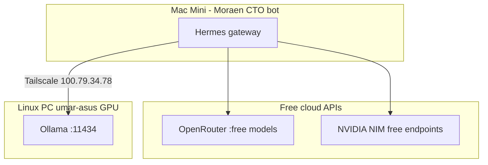

# Moraen CTO Bot — Model Routing for GroundWork

**Bot:** Telegram `@moraen_cto_bot` · Mac Mini Hermes `~/.hermes/profiles/cto/`  
**Constraint:** **No CrofAI.** Only free inference from:
1. **NVIDIA NIM** (free hosted endpoints @ `integrate.api.nvidia.com`)
2. **OpenRouter** (`:free` models)
3. **Ollama on Linux PC GPU** (`100.79.34.78:11434` via Tailscale)

---

## TL;DR — recommended stack (no CrofAI)

| Role | Model | Provider | Why |
|---|---|---|---|
| **Primary orchestrator** (overnight docs) | `google/gemma-4-31b-it:free` | OpenRouter | 262k ctx, strong prose, $0, no timeout issues like M2.7 on long threads |
| **Hard docs** (GDD, architecture) | `meta/llama-3.3-70b-instruct` | NIM free endpoint | Better quality when OR rate-limits |
| **JSON / code delegation** | `qwen/qwen3-next-80b-a3b-instruct:free` | OpenRouter | Best free 80B for structure + C# stubs |
| **Local coding fallback** | `qwen2.5-coder:14b-instruct-q4_K_M` | Ollama @ Linux PC | Unlimited, no cloud rate limits |
| **Simple Telegram acks** | `google/gemma-3-27b-it` | NIM free | Fast, cheap tier via smart routing |
| **PR / spec review** | `deepseek/deepseek-r1:free` | OpenRouter | Reasoning before you merge |
| **Emergency (OR + NIM throttled)** | `gemma4:e4b-it-q4_K_M` | Ollama @ Linux PC | Always on, $0 |

**MiniMax M2.7 (NIM):** optional for **short** replies only (&lt;20 tool turns). **Not** primary — times out ~84k tokens on long SDLC sessions.

---

## Provider topology



| Provider | Base URL | Auth | Limits |
|---|---|---|---|
| OpenRouter | `https://openrouter.ai/api/v1` | `OPENROUTER_API_KEY` | Rate limits on `:free` models |
| NVIDIA NIM | `https://integrate.api.nvidia.com/v1` | `NVIDIA_API_KEY` (nvapi-…) | ~40 req/min free tier; use free-endpoint models only |
| Ollama (Linux PC) | `http://100.79.34.78:11434` | none (Tailscale LAN) | GPU-bound; unlimited requests |

**Linux PC models (confirmed on umar-asus):**

| Ollama model | Use |
|---|---|
| `qwen2.5-coder:14b-instruct-q4_K_M` | JSON, C#, SQL, boilerplate |
| `gemma4:e4b-it-q4_K_M` | General overflow when cloud throttles |

Ensure Ollama listens on Tailscale (`OLLAMA_HOST=0.0.0.0:11434` on Linux PC).

---

## Recommended `config.yaml` (Mac Mini — conceptual)

```yaml
# ~/.hermes/profiles/cto/config.yaml
# NO crof.ai — GroundWork constraint

model:
  default: google/gemma-4-31b-it:free
  provider: openrouter
  base_url: https://openrouter.ai/api/v1
  max_tokens: 8192
  context_length: 262144

fallback_model:
  # Tier 1 — NIM free (when OpenRouter rate-limits)
  - provider: custom
    base_url: https://integrate.api.nvidia.com/v1
    model: meta/llama-3.3-70b-instruct
    api_key: ENV_NVIDIA_API_KEY

  # Tier 2 — NIM Gemma (fast, free endpoint)
  - provider: custom
    base_url: https://integrate.api.nvidia.com/v1
    model: google/gemma-3-27b-it
    api_key: ENV_NVIDIA_API_KEY

  # Tier 3 — Local GPU (never rate-limited)
  - provider: custom
    base_url: http://100.79.34.78:11434/v1
    model: gemma4:e4b-it-q4_K_M

  # Tier 4 — Short replies only (NOT overnight primary)
  - provider: custom
    base_url: https://integrate.api.nvidia.com/v1
    model: minimaxai/minimax-m2.7
    api_key: ENV_NVIDIA_API_KEY

smart_model_routing:
  enabled: true
  max_simple_chars: 400
  cheap_model:
    provider: custom
    base_url: https://integrate.api.nvidia.com/v1
    model: google/gemma-3-27b-it
    api_key: ENV_NVIDIA_API_KEY
    max_tokens: 1024

compression:
  summary_model: google/gemma-3-27b-it   # NIM — not M2.7

delegation:
  # Sub-agent: JSON, C#, SQL
  model: qwen/qwen3-next-80b-a3b-instruct:free
  provider: openrouter
  max_iterations: 25
  fallback_model:
    provider: custom
    base_url: http://100.79.34.78:11434/v1
    model: qwen2.5-coder:14b-instruct-q4_K_M
```

Store keys in `~/.hermes/profiles/cto/.env` — never commit.

```bash
OPENROUTER_API_KEY=sk-or-...
NVIDIA_API_KEY=nvapi-...
# No CROFAI_API_KEY
```

Restart after edit: `launchctl kickstart -k gui/$(id -u)/ai.hermes.gateway-cto`

---

## Task → model map (GroundWork)

### Phase 0 — docs (now)

| Task | Primary | Fallback |
|---|---|---|
| All P0 markdown docs | OR `gemma-4-31b-it:free` | NIM `llama-3.3-70b-instruct` → Ollama `gemma4` |
| `GDD.md`, `architecture.md` (hard prose) | NIM `llama-3.3-70b-instruct` | OR `gemma-4-31b-it:free` |
| `crops.json` structured fill | Delegate OR `qwen3-next-80b:free` | Ollama `qwen2.5-coder:14b` |
| Mandi research notes | OR `gemma-4-31b-it:free` | NIM `llama-3.3-70b-instruct` |
| Telegram status ping | NIM `gemma-3-27b-it` (smart routing) | — |
| Pre-merge PR review | OR `deepseek-r1:free` | — |

### Phase 1+ — game code

| Task | Primary | Fallback |
|---|---|---|
| C# / ScriptableObject stubs | Delegate OR `qwen3-next-80b:free` | Ollama `qwen2.5-coder:14b` |
| Economy / backend markdown | OR `gemma-4-31b-it:free` | NIM `llama-3.3-70b` |
| Unity scenes / Play mode | **Cursor + Unity MCP (you)** — not chat model | — |

---

## Why NOT MiniMax M2.7 as primary

Your runbook (2026-06-04) shows M2.7 **timeout at ~84k–87k tokens** on long tool-heavy threads. Overnight GroundWork goals (8 docs + git + PR) exceed that. Use M2.7 on NIM only for quick Telegram acks.

---

## Why OpenRouter Gemma 4 31B free as primary (not M2.7)

| Model | Context | Long SDLC threads | Cost |
|---|---|---|---|
| OR `gemma-4-31b-it:free` | 262k | Stable | $0 |
| NIM `minimax-m2.7` | 202k | **Timeouts** | Free tier credits |
| Ollama `gemma4` | ~8k–32k effective | OK for single files | $0 |

For multi-file doc sprints, **262k OpenRouter Gemma** beats local Ollama context. Use **Linux GPU Ollama** when cloud rate-limits hit.

---

## Session hygiene

1. `/reset` before every overnight GroundWork goal
2. One goal per session (all 8 P0 docs OK on 262k ctx)
3. If OpenRouter returns 429 → auto-fallback to NIM, then Ollama
4. Split across 2 nights if `max_turns: 40` hit

---

## Verify

```bash
# Mac Mini — cloud
curl -s https://openrouter.ai/api/v1/models -H "Authorization: Bearer $OPENROUTER_API_KEY" | head

# Mac Mini — Linux PC Ollama via Tailscale
curl -s http://100.79.34.78:11434/api/tags

# Logs
tail -30 ~/.hermes/profiles/cto/logs/gateway.error.log
```

Telegram test after `/reset`:

```text
GroundWork model test: reply with which provider answered (OR/NIM/Ollama)
```

---

## Cost

| Source | GroundWork overnight | Monthly |
|---|---|---|
| OpenRouter `:free` | Primary | $0 |
| NVIDIA NIM free endpoints | Fallback + smart routing | $0 (rate-limited) |
| Ollama Linux PC GPU | Overflow + coding delegate | $0 (your electricity) |
| CrofAI | **Not used** | $0 |

---

## References

- NIM free catalog: [build.nvidia.com/models](https://build.nvidia.com/models) — filter **Free Endpoint**
- OpenRouter free: models ending in `:free`
- Linux PC Ollama: `arsalan@100.79.34.78` (Tailscale)
- GroundWork tasks: [moraen-cto-tasks.md](moraen-cto-tasks.md)
- Failure runbook: `ai-router/docs/moraen-cto-provider-failure-runbook.md`
