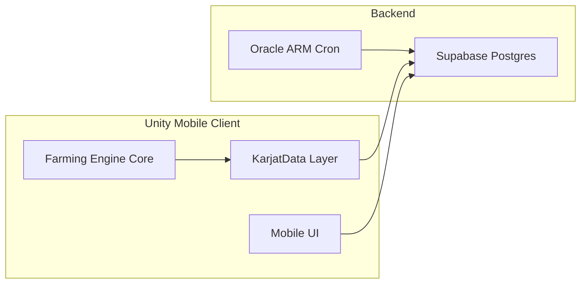

# GroundWork — Architecture Overview

**Status:** draft — outline only (Moraen to complete)  
**Phase:** 0 P0

---

## 1. System diagram

<!-- Required: Mermaid or ASCII diagram showing:
     Unity Mobile Client → Supabase (Postgres, Auth, Edge Functions, Realtime)
     Oracle ARM VM → cron (AI trader, dev farm bot)
     Source: plan §2 diagram -->

## 2. Client layers

<!-- Table: Engine, Input, Local state, Karjat data, Networking, IAP, Analytics
     Source: plan §2 Client table -->

## 3. Backend stack

<!-- Supabase: auth, tables, RLS, Edge Functions, cost
     Oracle: AI trader cron, dev farm
     Avoid: PlayFab, blockchain
     Source: plan §2 Backend -->

## 4. Dual-build architecture (IN vs GLOBAL)

<!-- India build: social game, no withdrawal UI
     Global build (Phase 4): deed owners, treasury withdrawal, geo-block India
     Source: plan §8 -->

## 5. Economy data pipeline

<!-- Agmarknet → mandi_prices → KarjatEconomyConfig → AI trader + player market
     Source: plan §2 economy pipeline -->

## 6. Offline-first strategy

<!-- JSON local save + cloud sync via Supabase; spotty Indian mobile networks -->

## 7. Security boundaries

<!-- RLS, server-side trade validation, no client Bushel injection -->
