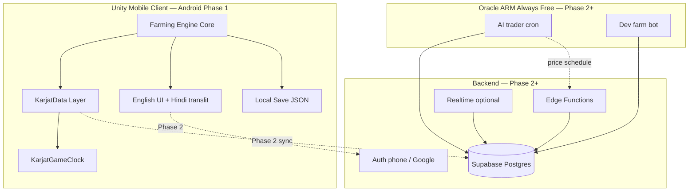
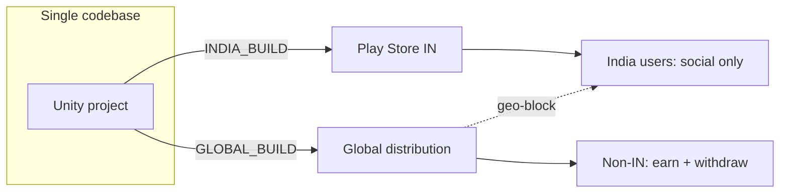

# GroundWork — Architecture Overview

**Status:** complete (PM draft — pending SA review)  
**Phase:** 0 P0  
**Author:** Cursor PM (2026-06-06)  
**Cross-ref:** Master plan §2 · [farming-engine-audit.md](farming-engine-audit.md) · [repo-structure.md](repo-structure.md)

---

## 1. System diagram



**Phase 0–1:** Client-only box is live. Dashed lines activate at Phase 2 (cloud save + market).

---

## 2. Client layers

| Layer | Choice | GroundWork use |
|---|---|---|
| **Engine** | Unity 2022.3 LTS + URP | Mobile export; Farming Engine v1.21 |
| **Template core** | `Assets/FarmingEngine/` (vendor, read-only) | PlantData, AnimalData, touch input, local save |
| **Karjat overlay** | `Assets/Scripts/` + `Resources/KarjatData/` | Season gates, crop SOs from `crops.json`, UI reskin |
| **Time** | `KarjatGameClock` subclasses FE `GameClock` | 20 min/day; Kharif/Rabi gates; IST display |
| **Input** | FE mobile touch | Plant / harvest / sell |
| **Local state** | FE save + JSON | Offline-first; cloud sync Phase 2 |
| **Networking** | Supabase REST / C# SDK | Phase 2: auth, listings, cloud save |
| **IAP** | Unity IAP → Google Play | Cosmetics + Farmer’s Pass (Phase 3) |
| **Analytics** | Unity Gaming Services or PostHog on Oracle | Funnel + economy tuning |
| **Build defines** | `INDIA_BUILD` / `GLOBAL_BUILD` | Feature flags — see §4 |

**Repo layout:** `groundwork-unity/` created Phase 1 day 1 (same PR as FE import per SA advisory).

---

## 3. Backend stack

### Supabase (primary — Phase 2+)

| Component | Use |
|---|---|
| **Auth** | Phone OTP or Google (India-friendly) |
| **Postgres** | `players`, `listings`, `transactions`, `economy_config`, `geo_cells`, `land_deeds`, `dev_farm_state` |
| **RLS** | Players write own listings only; economy_config read-only for clients |
| **Edge Functions** | Trade validation, anti-cheat Bushel checks |
| **Realtime** | Optional market ticker at soft launch |
| **Cost** | Free tier → ~2K–10K MAU at ₹0 |

### Oracle Cloud Always Free ARM (secondary — Phase 2+)

| Job | Schedule |
|---|---|
| AI weekly trader | Saturday 10:00 IST (configurable) |
| Dev farm bot | Same tick as players — no god-mode spawn |
| Economy whitepaper API | Static hosting optional |

**Fallback:** Supabase `pg_cron` + Edge Functions if Oracle capacity unavailable.

### Explicitly avoided

- PlayFab (lifetime account limits post-2026)
- Blockchain / on-chain Bushels
- Client-authoritative economy

---

## 4. Dual-build architecture (IN vs GLOBAL)

Single Unity codebase. Backend returns `region_policy` at login (Phase 2+) or compile-time defines for store builds.

### India build (`INDIA_BUILD`) — Play Store India only

```json
{
  "region": "IN",
  "withdrawal_enabled": false,
  "bushel_purchase_enabled": false,
  "market_enabled": true,
  "direct_sell_enabled": true,
  "copy_key": "bushels_no_cash_value"
}
```

| Feature | India build |
|---|---|
| Bushel withdrawal | **Off** |
| Buy Bushels with INR | **Off** (PROGA) |
| Direct harvest-sell | **On** (Phase 1) |
| Player market | Phase 2+ |
| IAP cosmetics | **On** (Phase 3) |
| Earth map / deeds | **Off** until Phase 2.5 |

### Global build (`GLOBAL_BUILD`) — Phase 4+, geo-blocked from India

```json
{
  "region": "GLOBAL",
  "withdrawal_enabled": true,
  "withdrawal_rails": ["telegram_stars", "usdt_polygon"],
  "min_withdrawal_usd": 5,
  "kyc_required": true,
  "deed_required_for_withdrawal": true
}
```

| Feature | Global build |
|---|---|
| Withdrawal | Deed-gated; treasury-capped |
| Store listing | **Not** Play Store India — Telegram / web / alt stores |
| Geo enforcement | IP + KYC + payment instrument + VPN flag |

### Geo enforcement layers (mandatory for global earn)

1. MaxMind IP geofence — block earn features for IN + sanctioned countries  
2. KYC document country — reject Indian passport on global earn  
3. Payment rail — no UPI / INR on withdrawal  
4. Play Store SKU separation — India = social build APK only  
5. App attestation — VPN detection → manual review  



---

## 5. Economy data pipeline

```
crops.json (git source of truth)
       ↓ scripts/generate_plantdata.py
Resources/KarjatData/*.asset (Unity)
       ↓
Phase 1: hand-tuned Bushel prices (playtest)
       ↓
Phase 2: Agmarknet / mandi CSV → Supabase mandi_prices
       ↓
economy_config table → AI trader + listing anchors
```

**Rule:** Mandi ₹/quintal is **directional research** — not auto-converted to Bushels (see [crops.md](../karjat-economy/crops.md)).

**Real-world calendar vs game calendar:** Maharashtra monsoon (Jun–Oct) maps to game-days **1–40** (Kharif), not literal dates — see [time-system.md §3](../gdd/time-system.md).

---

## 6. Offline-first strategy

| Concern | Approach |
|---|---|
| Spotty mobile networks | Full farm sim runs locally; network optional |
| Save format | Farming Engine local save (Phase 1) |
| Cloud sync | Supabase `PlayerSave` blob (Phase 2) |
| Conflict resolution | Server wins on Bushel balance; merge farm layout with timestamp |
| Offline catch-up | Cap **1 game-day progress per real-day absent** (Phase 1 client cap; SA advisory) |
| Cheat surface | Client Bushel edits ignored once server validation live |

---

## 7. Security boundaries

| Boundary | Rule |
|---|---|
| Bushel grants | Server-side only post-Phase 2 |
| Listings / trades | Edge Function validates price bounds + inventory |
| economy_config | RLS read-only; admin service role writes |
| IAP receipts | Google Play server verify before cosmetic unlock |
| Admin | No production keys in repo; Doppler / CI secrets |

---

## 8. Phase roadmap (architecture activation)

| Phase | Architecture milestone |
|---|---|
| **0** | Docs only — this file + GDD + audits |
| **1** | Unity client offline; `groundwork-unity/` in repo; KarjatData injection |
| **2** | Supabase auth + cloud save + fixed-price market + Edge validation |
| **2.5** | `geo_cells`, land deeds, Earth map client module |
| **3** | IAP, AI trader cron on Oracle, dev farm |
| **4** | GLOBAL_BUILD, withdrawal rails, IFZA entity, geo-block IN |

**Phase 1 exit gate:** Do **not** provision Supabase production until 5-player offline playtest passes (plan §4).

---

## 9. Machine roles (dev workflow)

| Machine | Role |
|---|---|
| Mac Mini | Unity + Cursor MCP + Moraen bot git push |
| moraen-Home | Cursor PM, `gh pr create`, Supabase MCP |
| umar-asus | HTML prototype deploy (`farms.appopoleis.com`) |

See [dev-workflow.md](dev-workflow.md) · [repo-structure.md §7](repo-structure.md).

---

## 10. Open architecture questions

| # | Question | Owner | Disposition |
|---|---|---|---|
| A1 | Supabase C# SDK vs raw REST | Phase 1 spike | Decide week 1 of Phase 2 |
| A2 | Oracle vs pg_cron for trader | Phase 2 ops | Try Oracle; fallback documented |
| A3 | Realtime ticker at launch | PM | **Defer** — polling OK for soft launch |
