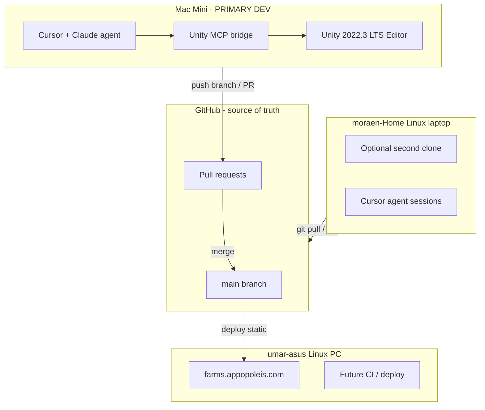
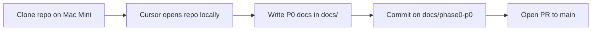

# GroundWork — Development Workflow

**Status:** active  
**Last updated:** 2026-06-05  
**Primary dev machine:** Mac Mini (`arsalans-mac-mini`)  
**Source of truth:** GitHub — `appopoleisStudios/karjat-farms`

---

## 1. Design principles

| Principle | Rule |
|---|---|
| One repo | Code, docs, Unity project, Supabase migrations — all in git |
| One primary dev seat | Mac Mini runs Unity + Cursor + MCP |
| GitHub is canonical | Machines are clones, not owners |
| Agent builds via MCP | Cursor/Claude on Mac Mini talks to **local** Unity Editor |
| PR before main | No direct commits to `main` after Phase 0 |
| Machines have roles | Mac = dev · Linux PC = prod web · Linux laptop = optional secondary |

---

## 2. Machine roles



| Machine | Tailscale IP | Role | Runs |
|---|---|---|---|
| **Mac Mini** | `100.127.150.60` | **Primary game dev** | Unity 2022.3 LTS, Cursor, Unity MCP, Blender (later) |
| **moraen-Home** | `100.99.243.39` | Secondary / agent host | Git clone, Cursor, Supabase MCP, planning |
| **umar-asus** | `100.79.34.78` | Production | HTML prototype via Cloudflare tunnel; future CI |

**Why Unity on Mac Mini (not Linux laptop or Linux PC):**

- Unity Hub + Android export work best on macOS for a solo learner
- Unity MCP bridges run **locally** — agent and Editor must be on the **same machine**
- Linux PC stays a stable production server; don't mix dev Editor onto it
- Linux laptop is optional; not required for daily game work

---

## 3. Daily workflow (Phase 1+)

### Morning — sync

```bash
cd ~/projects/karjat-farms
git checkout main && git pull
git checkout -b feature/my-task   # or docs/my-doc
```

### Work — Cursor on Mac Mini

1. Open Cursor with repo folder: `~/projects/karjat-farms`
2. Unity Editor open with `groundwork-unity/` project
3. Unity MCP bridge running (see §5)
4. Ask Claude/Cursor agent to:
   - Edit C# scripts, ScriptableObjects, JSON configs
   - Create/modify scenes via MCP tools
   - Run play mode tests, capture screenshots
   - Update docs in `docs/`

### End of session — ship via PR

```bash
git add -A
git commit -m "feat: add Karjat methi PlantData ScriptableObject"
git push -u origin feature/my-task
gh pr create --title "..." --body "..."
```

Merge to `main` after review (solo: self-review checklist in PR template).

### Deploy (prototype web only, until Unity launch)

`main` → manual or scripted deploy to umar-asus for `farms.appopoleis.com` (HTML prototype). Unity Android builds are separate (Phase 1+).

---

## 4. SDLC — branches & PRs

| Branch | Purpose | Merge target |
|---|---|---|
| `main` | Production-ready | — |
| `docs/phase0-p0` | Phase 0 P0 documentation | `main` via PR |
| `feature/*` | Game features, Unity code | `main` via PR |
| `fix/*` | Bug fixes | `main` via PR |
| `docs/*` | Documentation updates | `main` via PR |

**Rules:**

- Never commit secrets (`.env`, Supabase service keys, keystore)
- Never commit Unity `Library/`, `Temp/`, `Logs/`, `UserSettings/`
- Unity project lives at `groundwork-unity/` (Phase 1)
- Large binaries use Git LFS if needed (Phase 2+)

**PR checklist (minimum):**

- [ ] Builds in Unity without console errors
- [ ] Play mode smoke test (plant/harvest or relevant feature)
- [ ] Docs updated if behavior changed
- [ ] `docs/dev-log.md` entry appended

---

## 5. AI agent + Unity MCP setup (Mac Mini)

Unity MCP requires the **AI client and Unity Editor on the same machine**. Cursor on Mac Mini → local Unity MCP → local Unity 2022.3.

### Recommended MCP stack for Unity 2022.3 LTS

Official Unity MCP (`com.unity.ai.assistant`) requires **Unity 6**. GroundWork uses **2022.3 LTS**, so use a community bridge:

| Option | Unity version | Notes |
|---|---|---|
| **[Funplay MCP](https://github.com/FunplayAI/funplay-unity-mcp)** | 2022.3+ | Best fit for our engine version; execute_code, screenshots, play mode |
| **[CoplayDev/unity-mcp](https://github.com/CoplayDev/unity-mcp)** | 2021.3+ | Mature, 10k+ stars; asset/scene/script tools |
| Official Unity MCP | Unity 6 only | Revisit if/when we upgrade engine |

**Install once on Mac Mini (Phase 1, after Unity project created):**

1. Install Unity 2022.3 LTS + Android Build Support via Unity Hub
2. Import chosen MCP package into `groundwork-unity/`
3. Start MCP bridge inside Unity (Window → MCP → Start Server)
4. Add MCP server to Cursor: **Settings → MCP → Add server** (use config from Unity MCP window)
5. Approve first connection in Unity MCP settings

**Example Cursor MCP config** (`.cursor/mcp.json` in repo — commit the template, not secrets):

```json
{
  "mcpServers": {
    "unity": {
      "url": "http://127.0.0.1:8765/"
    }
  }
}
```

Port/path varies by MCP package — copy from the Unity MCP window after install.

### What the agent can do via MCP

- Create/edit scenes, GameObjects, components
- Write and compile C# scripts
- Import/configure Farming Engine ScriptableObjects
- Enter/exit Play mode, capture screenshots
- Trigger Android builds (with your approval)
- Read console logs for debugging

### What still needs a human

- First-time Unity Hub / license login
- Google Play signing keystore creation
- App Store / Play Console submission
- Legal/compliance sign-off
- Merging PRs you want to review carefully

### Blender MCP (Phase 1+ art pipeline)

When low-poly assets are needed:

- Blender runs on **Mac Mini** (same machine as agent)
- Configure Blender MCP in Cursor the same way
- Agent generates/edits meshes → export FBX/glTF → import to Unity

Unreal is out of scope (GroundWork is Unity + Farming Engine).

---

## 6. Phase 0 workflow (now — docs only)

No Unity yet. Workflow is docs + git only.



**Mac Mini setup (one time):**

```bash
# Install Git + GitHub CLI if missing: brew install git gh
gh auth login
git clone https://github.com/appopoleisStudios/karjat-farms.git ~/projects/karjat-farms
cd ~/projects/karjat-farms
git checkout docs/phase0-p0   # after branch is pushed
```

Open `~/projects/karjat-farms` in Cursor. Read [HANDOFF-MORAEN.md](../HANDOFF-MORAEN.md). No SSH to Linux laptop required.

**Push `docs/phase0-p0` from Linux laptop first** (one-time sync):

```bash
git push -u origin docs/phase0-p0
```

---

## 7. Supabase & backend MCP

| MCP | Where it runs | Use |
|---|---|---|
| Supabase MCP | Cursor on **any machine** with MCP configured | Schema, migrations, Edge Functions, logs |
| Unity MCP | Cursor on **Mac Mini only** | Editor automation |

Backend work does not require Mac Mini — but keeping one Cursor seat on Mac Mini avoids context switching during full-stack tasks.

---

## 8. Cursor session patterns

### Pattern A — Unity feature (most common)

```
Machine: Mac Mini
Open: Cursor + Unity Editor + MCP bridge
Prompt: "Add Karjat methi as a PlantData ScriptableObject from docs/karjat-economy/crops.json"
Agent: edits JSON → creates SO → places test plot in scene via MCP → runs play mode
You: review diff → commit → PR
```

### Pattern B — Docs / economy spec

```
Machine: Mac Mini (or Linux laptop)
Open: Cursor, repo only (Unity closed)
Prompt: "Complete docs/gdd/time-system.md per plan section 4"
Agent: writes markdown → commit → PR
```

### Pattern C — Backend schema

```
Machine: any
Open: Cursor + Supabase MCP
Prompt: "Design players and listings tables with RLS"
Agent: writes docs/backend/database-schema.md + migration SQL
```

---

## 9. What we retired

| Old idea | Replacement |
|---|---|
| Docs live on Linux laptop | Docs in git; edit on Mac Mini |
| Moraen SSH into Linux laptop | Clone repo locally on Mac Mini |
| Agent on Linux controls Unity on Mac | Agent on Mac Mini with Unity MCP |
| Linux laptop as repo host | GitHub as repo host |

Linux laptop SSH setup remains useful as a **backup access path**, not the primary workflow.

---

## 10. Setup checklist

### Mac Mini — Phase 0 (now)

- [ ] `git clone` + `gh auth login`
- [ ] Cursor installed, repo opened locally
- [ ] Checkout `docs/phase0-p0`, complete P0 docs
- [ ] PR `docs/phase0-p0` → `main`

### Mac Mini — Phase 1 (Unity)

- [ ] Unity Hub 2022.3 LTS + Android module
- [ ] Purchase + import Farming Engine ($49)
- [ ] Create `groundwork-unity/` project (URP)
- [ ] Install Unity MCP package (Funplay or CoplayDev)
- [ ] Configure `.cursor/mcp.json`
- [ ] Verify agent can list scenes via MCP
- [ ] First PR: import FE demo + Karjat crop JSON

### Linux laptop — optional

- [ ] Keep clone synced via `git pull`
- [ ] Supabase MCP for backend sessions
- [ ] Push `docs/phase0-p0` if not yet on GitHub

### Linux PC — production

- [ ] Continue serving HTML prototype from `main`
- [ ] Future: GitHub Action deploy on merge to `main`

---

## 11. References

- Master plan: `/home/moraen/.cursor/plans/groundwork_game_plan_e9f1bee0.plan.md`
- Phase 0 tasks: [HANDOFF-MORAEN.md](../HANDOFF-MORAEN.md)
- Repo layout: [repo-structure.md](repo-structure.md)
- Architecture: [architecture.md](architecture.md)
