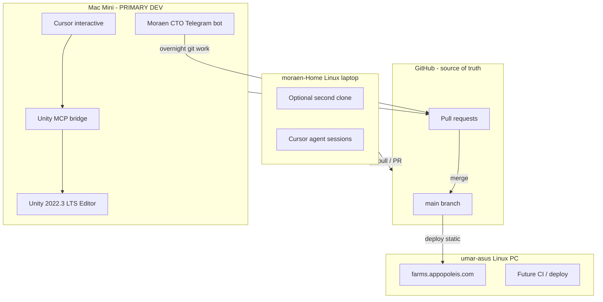
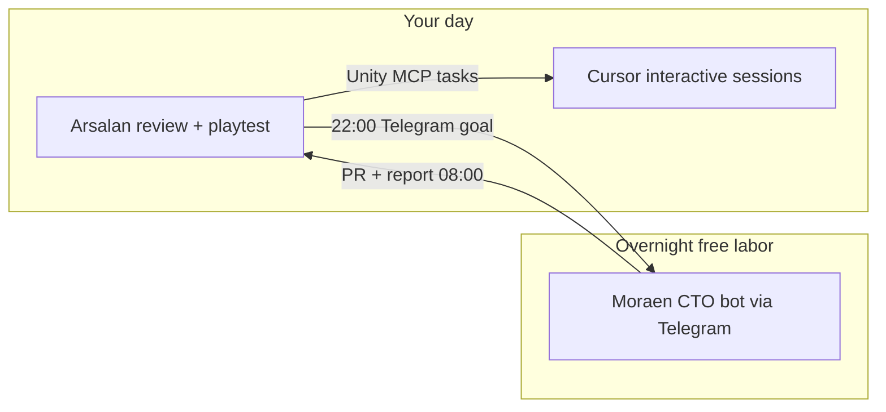
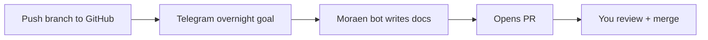

# GroundWork — Development Workflow

**Status:** active  
**Last updated:** 2026-06-05  
**Primary dev machine:** Mac Mini (`arsalans-mac-mini`)  
**Source of truth:** GitHub — `appopoleisStudios/karjat-farms`  
**Async labor:** Moraen CTO bot — Telegram `@moraen_cto_bot` (free, overnight)  
**Coordination:** [coordination.md](../coordination.md) · **Moraen tasks:** [ops/moraen-cto-tasks.md](../ops/moraen-cto-tasks.md)

---

## 1. Design principles

| Principle | Rule |
|---|---|
| One repo | Code, docs, Unity project, Supabase migrations — all in git |
| One primary dev seat | Mac Mini runs Unity + Cursor + MCP + Moraen Hermes |
| Three agents | **You** (review/merge) · **Cursor** (interactive Unity MCP) · **Moraen bot** (async Telegram, free) |
| GitHub is canonical | Machines are clones, not owners |
| Unity MCP = interactive only | Cursor on Mac Mini talks to **local** Unity Editor |
| Moraen bot = async labor | Docs, research, boilerplate, PRs — via Telegram overnight goals |
| PR before main | No direct commits to `main` after Phase 0 |
| Machines have roles | Mac = dev · Linux PC = prod web · Linux laptop = optional secondary |

---

## 2. Machine roles



| Machine | Tailscale IP | Role | Runs |
|---|---|---|---|
| **Mac Mini** | `100.127.150.60` | **Primary game dev** | Unity 2022.3 LTS, Cursor, Unity MCP, **Moraen CTO bot** (Hermes), Blender (later) |
| **moraen-Home** | `100.99.243.39` | Secondary / agent host | Git clone, Cursor, Supabase MCP, planning |
| **umar-asus** | `100.79.34.78` | Production | HTML prototype via Cloudflare tunnel; future CI |

**Why Unity on Mac Mini (not Linux laptop or Linux PC):**

- Unity Hub + Android export work best on macOS for a solo learner
- Unity MCP bridges run **locally** — agent and Editor must be on the **same machine**
- Linux PC stays a stable production server; don't mix dev Editor onto it
- Linux laptop is optional; not required for daily game work

---

## 3. Three-agent workflow



| When | Agent | Example |
|---|---|---|
| **Morning** | You | Review Moraen's overnight PR; merge docs |
| **Day** | Cursor + you | Unity MCP: wire crops, Play mode, debug |
| **Evening** | You → Moraen bot | Send overnight goal (see [moraen-cto-tasks.md](../ops/moraen-cto-tasks.md)) |
| **Night** | Moraen bot (free) | Write docs, research mandi prices, open PR |

Full task routing table: [ops/moraen-cto-tasks.md](../ops/moraen-cto-tasks.md)

---

## 4. Daily workflow (Phase 1+)

### Morning — review Moraen + sync

1. Read Moraen Telegram report (if overnight goal was set)
2. Review/open PR on GitHub
3. Merge doc-only PRs yourself; Unity PRs → checkout branch for MCP session

```bash
cd ~/projects/karjat-farms
git checkout main && git pull
git checkout -b feature/my-task   # or continue Moraen's branch
```

### Day — Cursor interactive (Unity MCP)

1. Open Cursor with repo: `~/projects/karjat-farms`
2. Unity Editor + MCP bridge running (see §6)
3. Use Cursor for **Unity MCP work only** — scenes, Play mode, builds
4. Do **not** duplicate doc work Moraen bot is doing overnight

### Evening — hand off to Moraen bot

Send Telegram overnight goal (template in [moraen-cto-tasks.md](../ops/moraen-cto-tasks.md)).

### End of session — ship via PR

```bash
git add -A
git commit -m "feat: add Karjat methi PlantData ScriptableObject"
git push -u origin feature/my-task
gh pr create --title "..." --body "..."
```

**You merge to `main`** after review. Moraen bot and Cursor agents do not merge.

### Deploy (prototype web only, until Unity launch)

`main` → manual or scripted deploy to umar-asus for `farms.appopoleis.com` (HTML prototype). Unity Android builds are separate (Phase 1+).

---

## 5. SDLC — branches & PRs

| Branch | Purpose | Merge target |
|---|---|---|
| `main` | Production-ready | — |
| `docs/phase0-p0` | Phase 0 P0 documentation | `main` via PR |
| `feature/*` | Game features, Unity code | `main` via PR |
| `fix/*` | Bug fixes | `main` via PR |
| `docs/*` | Documentation updates | `main` via PR |

**Rules:**

- Never commit secrets (`.env`, Supabase service keys, keystore)
- Never commit Unity `Library/`, `Temp/`, `Logs/`, `UserSettings/`
- Unity project lives at `groundwork-unity/` (Phase 1)
- Large binaries use Git LFS if needed (Phase 2+)

**PR checklist (minimum):**

- [ ] Builds in Unity without console errors
- [ ] Play mode smoke test (plant/harvest or relevant feature)
- [ ] Docs updated if behavior changed
- [ ] `docs/dev-log.md` entry appended

---

## 6. Moraen CTO bot setup (Mac Mini)

**Bot:** Telegram `@moraen_cto_bot` · Hermes `~/.hermes/profiles/cto/`  
**Cost:** Free (Hermes routes to free-tier models)

### One-time

1. Confirm Hermes gateway running: `ai.hermes.gateway-cto` LaunchAgent
2. Clone repo on Mac Mini: `~/projects/karjat-farms`
3. Add `karjat-farms` to Moraen SOUL repo list (if not present)
4. Push `docs/phase0-p0` to GitHub so Moraen can pull

### Nightly use

```text
GroundWork overnight — karjat-farms
Branch: docs/phase0-p0
Goals: [numbered list from HANDOFF-MORAEN.md]
Read: docs/HANDOFF-MORAEN.md
Do NOT: merge to main, start Unity
```

See full templates: [ops/moraen-cto-tasks.md](../ops/moraen-cto-tasks.md)

### What Moraen bot owns for GroundWork

- All Phase 0 P0 doc bodies (you review, not write)
- Agmarknet / crop research
- JSON extraction, markdown specs, dev-log entries
- Branch commit, push, PR open, Telegram report

### What Moraen bot does NOT do

- Unity MCP / Play mode / APK builds
- Merge to `main`
- Touch secrets or production Supabase

---

## 7. AI agent + Unity MCP setup (Mac Mini — interactive only)

Unity MCP requires the **AI client and Unity Editor on the same machine**. Cursor on Mac Mini → local Unity MCP → local Unity 2022.3.

### Recommended MCP stack for Unity 2022.3 LTS

Official Unity MCP (`com.unity.ai.assistant`) requires **Unity 6**. GroundWork uses **2022.3 LTS**, so use a community bridge:

| Option | Unity version | Notes |
|---|---|---|
| **[Funplay MCP](https://github.com/FunplayAI/funplay-unity-mcp)** | 2022.3+ | Best fit for our engine version; execute_code, screenshots, play mode |
| **[CoplayDev/unity-mcp](https://github.com/CoplayDev/unity-mcp)** | 2021.3+ | Mature, 10k+ stars; asset/scene/script tools |
| Official Unity MCP | Unity 6 only | Revisit if/when we upgrade engine |

**Install once on Mac Mini (Phase 1, after Unity project created):**

1. Install Unity 2022.3 LTS + Android Build Support via Unity Hub
2. Import chosen MCP package into `groundwork-unity/`
3. Start MCP bridge inside Unity (Window → MCP → Start Server)
4. Add MCP server to Cursor: **Settings → MCP → Add server** (use config from Unity MCP window)
5. Approve first connection in Unity MCP settings

**Example Cursor MCP config** (`.cursor/mcp.json` in repo — commit the template, not secrets):

```json
{
  "mcpServers": {
    "unity": {
      "url": "http://127.0.0.1:8765/"
    }
  }
}
```

Port/path varies by MCP package — copy from the Unity MCP window after install.

### What the agent can do via MCP

- Create/edit scenes, GameObjects, components
- Write and compile C# scripts
- Import/configure Farming Engine ScriptableObjects
- Enter/exit Play mode, capture screenshots
- Trigger Android builds (with your approval)
- Read console logs for debugging

### What still needs a human

- First-time Unity Hub / license login
- Google Play signing keystore creation
- App Store / Play Console submission
- Legal/compliance sign-off
- Merging PRs you want to review carefully

### Blender MCP (Phase 1+ art pipeline)

When low-poly assets are needed:

- Blender runs on **Mac Mini** (same machine as agent)
- Configure Blender MCP in Cursor the same way
- Agent generates/edits meshes → export FBX/glTF → import to Unity

Unreal is out of scope (GroundWork is Unity + Farming Engine).

---

## 8. Phase 0 workflow (now — docs only)

No Unity yet. **Moraen bot writes docs overnight; you review and merge.**



**Your steps:**

1. Ensure `docs/phase0-p0` is on GitHub
2. Send Moraen bot the Phase 0 overnight template ([moraen-cto-tasks.md](../ops/moraen-cto-tasks.md))
3. Morning: review PR, merge to `main`

**Optional:** Cursor on Mac Mini for doc edits you want to do interactively — don't duplicate Moraen's overnight queue.

---

## 9. Supabase & backend MCP

| MCP | Where it runs | Use |
|---|---|---|
| Supabase MCP | Cursor on **any machine** with MCP configured | Schema, migrations, Edge Functions, logs |
| Unity MCP | Cursor on **Mac Mini only** | Editor automation |

Backend work does not require Mac Mini — but keeping one Cursor seat on Mac Mini avoids context switching during full-stack tasks.

---

## 10. Session patterns

### Pattern A — Unity feature (Cursor interactive, daytime)

```
Machine: Mac Mini
Open: Cursor + Unity Editor + MCP bridge
Prompt: "Add Karjat methi as a PlantData ScriptableObject from docs/karjat-economy/crops.json"
Agent: creates SO → places test plot via MCP → runs play mode
You: review diff → commit → PR → merge
```

### Pattern B — Docs / research (Moraen bot, overnight)

```
Machine: Mac Mini (headless Hermes)
Trigger: Telegram overnight goal to @moraen_cto_bot
Moraen: writes docs, researches mandi prices, updates crops.json, opens PR
You: morning review → merge
```

### Pattern C — Backend schema (split)

```
Night — Moraen bot: draft docs/backend/database-schema.md + SQL migration file
Day — Cursor + Supabase MCP: apply migration, test RLS
You: merge after both steps pass
```

---

## 11. What we retired

| Old idea | Replacement |
|---|---|
| Docs live on Linux laptop | Docs in git; edit on Mac Mini |
| Moraen SSH into Linux laptop | Clone repo locally on Mac Mini |
| Agent on Linux controls Unity on Mac | Cursor on Mac Mini with Unity MCP |
| Linux laptop as repo host | GitHub as repo host |
| You write all docs manually | Moraen bot writes docs overnight (free) |

Linux laptop SSH setup remains useful as a **backup access path**, not the primary workflow.

---

## 12. Setup checklist

### Mac Mini — Phase 0 (now)

- [ ] `git clone` + `gh auth login`
- [ ] Hermes Moraen gateway running (`ai.hermes.gateway-cto`)
- [ ] Send first overnight Telegram goal ([moraen-cto-tasks.md](../ops/moraen-cto-tasks.md))
- [ ] Review Moraen PR → merge `docs/phase0-p0` → `main`

### Mac Mini — Phase 1 (Unity)

- [ ] Unity Hub 2022.3 LTS + Android module
- [ ] Purchase + import Farming Engine ($49)
- [ ] Create `groundwork-unity/` project (URP)
- [ ] Install Unity MCP package (Funplay or CoplayDev)
- [ ] Configure `.cursor/mcp.json`
- [ ] Verify agent can list scenes via MCP
- [ ] First PR: import FE demo + Karjat crop JSON

### Linux laptop — optional

- [ ] Keep clone synced via `git pull`
- [ ] Supabase MCP for backend sessions
- [ ] Push `docs/phase0-p0` if not yet on GitHub

### Linux PC — production

- [ ] Continue serving HTML prototype from `main`
- [ ] Future: GitHub Action deploy on merge to `main`

---

## 13. References

- Master plan: `/home/moraen/.cursor/plans/groundwork_game_plan_e9f1bee0.plan.md`
- Phase 0 tasks: [HANDOFF-MORAEN.md](../HANDOFF-MORAEN.md)
- Moraen bot tasks: [ops/moraen-cto-tasks.md](../ops/moraen-cto-tasks.md)
- Agent queue: [coordination.md](../coordination.md)
- Repo layout: [repo-structure.md](repo-structure.md)
- Architecture: [architecture.md](architecture.md)
- Moraen platform rules: `ai-router/.cursor/rules/moraen-cto-boundary.mdc`
